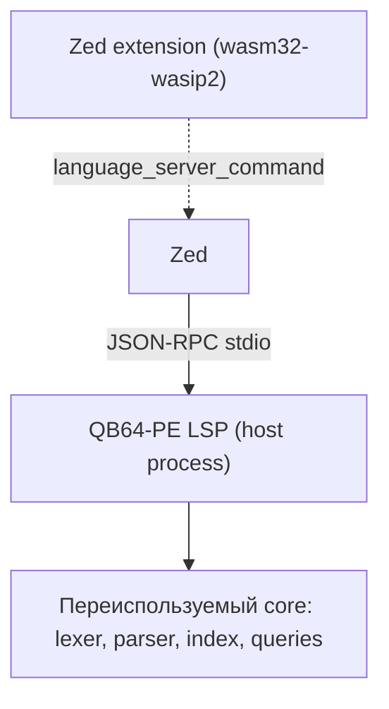

# План: языковой сервер (LSP) для QB64-PE в Zed

> Обзор расширения и его возможностей — в [`README.ru.md`](../README.ru.md).

> **⚠️ Внимание:** Весь проект целиком написан ИИ. Автор его не проверял и
> вряд ли когда-нибудь проверит. Используйте на свой страх и риск.

Документ описывает, как довести Zed-расширение до функциональности
«языкового интеллекта» референсного VS Code-расширения
[`grymmjack/qb64pe-vscode`](https://github.com/grymmjack/qb64pe-vscode):
автодополнение, hover-справка, переход к определению / ссылки / переименование,
live-линтинг, семантическая подсветка, иерархия вызовов и отладчик `vwatch`.

Сейчас в расширении реализована «редакторная» половина: грамматика,
подсветка, outline, авто-отступы, сниппеты, задачи и внешний форматтер.
Всё, что перечислено выше, работает через extension host VS Code и требует
языкового сервера для Zed.

---

## 0. Текущий статус: Этап 0 (спайк) выполнен

В репозитории уже есть работающий каркас сервера:

| Компонент | Путь | Состояние |
| --- | --- | --- |
| Вендоренные core-модули | `server/src/core/*.ts` | из расширения VS Code (MIT): `lexer`, `symbols`, `parser`, `index`, `queries`, `diagnostics`, `folding`, `keywords`, `condCompile`, `format`, `wikitext`, `helpFiles`, `rename`, `callHierarchy`, `colors`, `semantic`; изменены только импорты (и конструктор `SymbolIndex`) |
| Построитель символов | `server/src/documentSymbols.ts` | спайк-замена `core/outline.ts` (без workspace-индекса) |
| Справка / дополнение | `server/src/{help,hover,completion,keywordInfo}.ts` | hover (символы + справка из вики), completion (scope, ключевые слова, члены TYPE, метакоманды) |
| Навигация | `server/src/{navigation,rename,signature,workspaceSymbols,workspace,uri}.ts` | definition, references, documentHighlight, prepareRename/rename, signatureHelp, workspace/symbol; скан workspace |
| Этап 4 | `server/src/{callHierarchy,colors,semanticTokens}.ts` | call hierarchy, свотчи цветов, семантические токены; инкрементальный синк |
| LSP-сервер | `server/src/server.ts` | `initialize`, `initialized`, `didOpen/didChange/didClose`, `documentSymbol`, `foldingRange`, `publishDiagnostics`, `hover`, `completion`, `definition`, `references`, `documentHighlight`, `prepareRename`, `rename`, `signatureHelp`, `workspace/symbol`, `prepareCallHierarchy`, `callHierarchy/*`, `documentColor`, `colorPresentation`, `semanticTokens/full`, `shutdown`, `exit` |
| Smoke-тест | `server/test/smoke.mjs` | полный JSON-RPC-цикл, 80 проверок, `npm run smoke` |
| Rust-пускач | `src/lib.rs`, `Cargo.toml` | запуск сервера, компилируется против `zed_extension_api` 0.7.0 |
| Регистрация LSP | `extension.toml` → `[language_servers.qb64pe]` | — |

Сервер намеренно без зависимостей (не используется `vscode-languageserver`),
поэтому запускается напрямую под Node 24 (type-stripping):

```sh
cd server && node src/server.ts --stdio   # или: npm run smoke
```

Rust-пускач ищет, в порядке приоритета: бинарь `qb64pe-lsp` в `$PATH`; иначе
Node (сначала встроенный в Zed через `zed::node_binary_path`, потом из `$PATH`)
вместе с путём к скрипту из переменной окружения `QB64PE_LSP_SERVER`.

---

## 1. Ключевое уточнение по архитектуре Zed

Расширения Zed бывают двух видов, и их важно не путать:

| Часть | Где исполняется | Для чего |
| --- | --- | --- |
| Код расширения (Rust) | `wasm32-wasip2`, песочница | метаданные, регистрация возможностей, **запуск** LSP/DAP |
| Языковой сервер (LSP) | **обычный процесс на хосте** | вся языковая логика |

Языковой сервер **нельзя** собрать как `wasm32-wasip2`: Zed запускает его как
отдельный процесс и общается по stdio протоколом JSON-RPC. Rust-код расширения
(wasm) — это только «пускач»: он возвращает Zed команду запуска сервера.



Отсюда два реалистичных пути:

| Вариант | Сервер | Что переиспользуем | Минус |
| --- | --- | --- | --- |
| **A. Гибрид (рекомендуется)** | Node/Bun-процесс | готовый `src/core/*` из VS Code-расширения | нужен Node или self-contained бандл |
| B. Полностью Rust | нативный Rust-бинарник | ничего (переписывание) | большой объём работы, дублирование логики |

**Рекомендация: вариант A.** В референсном проекте уже есть
`vscode-free`, покрытые юнит-тестами модули `src/core/*`
(`lexer`, `parser`, `index`, `queries`, `indent`, `format`, `labels`,
`diagnostics`, `semantic`, `flatten`, `vwatch*`). Это ровно та логика, что
нужна LSP. Обёртка в `vscode-languageserver` даёт результат в разы быстрее, чем
переписывание на Rust, и сохраняет единый источник правды.

Rust-часть остаётся ровно одна: wasm-пускач, который говорит Zed, чем запускать
сервер (`node server/index.js` или скачанный self-contained бинарник).

---

## 2. Что именно переносится (карта модулей)

| Модуль VS Code-расширения | LSP-возможность | Приоритет |
| --- | --- | --- |
| `core/lexer.ts`, `core/parser.ts` | фундамент для всех остальных фич | 0 |
| `core/index.ts`, `providers/WorkspaceSymbolIndex.ts`, `core/flatten.ts` | граф `$INCLUDE`, глобальный индекс символов | 1 |
| `providers/IndexDiagnostics.ts`, `core/diagnostics.ts` | `publishDiagnostics` (live-линтинг) | 1 |
| `core/outline.ts` | `textDocument/documentSymbol` | 1 |
| `core/folding.ts` | `textDocument/foldingRange` | 1 |
| `core/semantic.ts` | `textDocument/semanticTokens` | 2 |
| `providers/CompletionItemProvider.ts`, `core/keywords.ts` | `textDocument/completion` | 2 |
| `providers/HoverProvider.ts`, `providers/HelpService.ts`, `core/wikitext.ts` | `textDocument/hover` (+ конвертация вики-справки) | 2 |
| `providers/SignatureHelpProvider.ts` | `textDocument/signatureHelp` | 3 |
| `providers/DefinitionProvider.ts` | `textDocument/definition` | 3 |
| `providers/ReferenceProvider.ts`, `core/queries.ts` | `textDocument/references` | 3 |
| `providers/RenameProvider.ts`, `core/rename.ts` | `textDocument/rename` / `prepareRename` | 3 |
| `providers/DocumentHighlightProvider.ts` | `textDocument/documentHighlight` | 3 |
| `core/callHierarchy.ts` | `textDocument/prepareCallHierarchy` / `callHierarchy/*` | 4 |
| `providers/ColorProvider.ts`, `core/colors.ts` | `textDocument/documentColor` | 4 |
| `providers/QB64DebugSession.ts`, `core/vwatch*` | **не LSP** — отдельное debugger-расширение (DAP) | 5 |

Форматтер из VS Code-расширения **уже портирован** в
`scripts/qb64pe-fmt.mjs` и к LSP не относится.

---

## 3. Этапы

### Этап 0. Спайк (1–2 дня) — ✅ выполнен
Цель — доказать сквозной путь, не трогая фичи.

1. ✅ Вынесены `src/core/*` референса (`lexer`, `symbols`, `parser`) в
   `server/src/core/` без зависимости от `vscode`.
2. ✅ Минимальный сервер: `initialize`, `initialized`, `textDocument/didOpen`,
   `textDocument/documentSymbol`, `shutdown`, `exit`.
3. ⚠️ Rust-пускач написан и проверен компиляцией (host); сборка wasm не
   прогонялась: в текущем окружении нет `rust-std` для `wasm32-wasip2`.
4. ✅ Проверка поведения: `server/test/smoke.mjs` подтверждает, что outline
   содержит `SUB`/`FUNCTION`/`TYPE`/`CONST`/метки и `$INCLUDE`.

**Ограничение окружения.** Полная сборка расширения
(`cargo build --target wasm32-wasip2`) требует стандартной библиотеки для wasm —
её нет в наличии. Поэтому проверено: `cargo check` для host-таргета (проходит,
API 0.7.0 использован корректно) плюс сквозной smoke-тест самого сервера.

### Этап 1. Каркас + базовые фичи — ✅ выполнен (кроме полного скана workspace)
- ✅ Полноценный LSP: `TextDocumentSyncKind.Full` (инкрементальный синк —
  оптимизация на потом).
- ✅ `documentSymbol` (`documentSymbols.ts`), `foldingRange` (`core/folding.ts`).
- ✅ Диагностики: `core/index.ts` + `core/diagnostics.ts` →
  `textDocument/publishDiagnostics` (on open/change), с маппингом
  severity и `DiagnosticTag.Unnecessary`.
- ✅ Граф `$INCLUDE` (`SymbolIndex`, `core/index.ts`) — резолвинг относительно
  файла и корня workspace, автозагрузка включённых файлов через `diskLoader`.
- ⏳ Полный скан workspace при старте (индексация всех `.bas/.bi/.bm` без
  ожидания `didOpen`) — отложен: сейчас индекс наполняется открытыми
  документами и `$INCLUDE`-графом. Требует обхода файлов workspace.

### Этап 2. Дополнение и справка — ✅ выполнен
- ✅ `completion`: 780+ ключевых слов + символы из scope + member-completion
  (`variable.` → поля `TYPE`) + метакоманды после `$` (с `textEdit`, чтобы
  клиент фильтровал по всему токену). Ранжирование — как в референсе
  (сначала пользовательские символы, потом ключевые слова).
- ✅ `hover`: пользовательские символы (scope-aware, `symbolMarkdown`) и
  справка ключевого слова; конвертация `*,txt`-справки (`core/wikitext.ts`,
  `core/helpFiles.ts`, `server/src/help.ts`) из `internal/help` с кэшем и
  деградацией до краткого описания.
- ✅ `initializationOptions` / env для пути справки; `triggerCharacters: [".", "$"]`;
  `completion_query_characters` в `config.toml`.
- ⏳ `semanticTokens` — не сделано; опционально включить `"semantic_tokens": "combined"` в Zed позже (требует LSP `semanticTokens`).

### Этап 3. Навигация — ✅ выполнен
- ✅ `definition` (`core/queries.ts` → `findDefinition`; переход к цели `$INCLUDE`/`$EXEICON`).
- ✅ `references` (`findOccurrences`, с учётом `context.includeDeclaration`).
- ✅ `rename` + `prepareRename` (`core/rename.ts`: валидация имени и сохранение
  сигнала; ошибки возвращаются как LSP `RequestFailed`).
- ✅ `documentHighlight` (read/write; только текущий файл).
- ✅ `signatureHelp` (скобочный и statement-вызов, активный параметр).
- ✅ `workspace/symbol` (`searchSymbols`) + полный скан workspace при `initialize`
  (`server/src/workspace.ts`) — закрывает отложенный пункт Этапа 1.

### Этап 4. Полировка — ✅ выполнен
- ✅ `callHierarchy`: `prepareCallHierarchy` / `incomingCalls` / `outgoingCalls`
  (`core/callHierarchy.ts`).
- ✅ `documentColor` + `colorPresentation` (`core/colors.ts`): свотчи для
  `_RGB*`/`_RGBA*`/`_HSB*`/`_HSBA*` с литеральными аргументами и перезапись
  вызова из пикера.
- ✅ `semanticTokens/full` (`core/semantic.ts`): стандартная легенда, дельтовое
  кодирование; в Zed включается `"semantic_tokens": "combined"`.
- ✅ Инкрементальный синк (`TextDocumentSyncKind.Incremental`): `didChange` с
  диапазонами применяется к отслеживаемому тексту.
- ⏳ Не сделано: `semanticTokens` delta, `textDocument/formatting` через LSP
  (формула уже есть как `scripts/qb64pe-fmt.mjs`, но как внешний форматтер).

### Этап 5. Отладчик (отдельное расширение) — ✅ выполнен (ядро)
Отладчик `vwatch` — это **DAP**, а не LSP. Реализовано в пределах этого
расширения:
- ✅ Вендорены кодек протокола (`core/vwatchProtocol.ts`), условия брейкпоинтов
  (`core/vwatchConditions.ts`), разбор таблицы переменных (`core/vwatchVars.ts`)
  и `$INCLUDE`-flatten (`core/flatten.ts`).
- ✅ DAP-адаптер (`server/src/dap/dapServer.ts`): launch (компиляция с
  `$DEBUG`), breakpoints (с hit-count), continue, step in/over/out, pause,
  call stack, scopes, locals/globals/constants, evaluate, disconnect.
- ✅ Rust-регистрация (`src/lib.rs`: `get_dap_binary`, `dap_request_kind`,
  `dap_config_to_scenario`), схема `debug_adapter_schemas/QB64PE.json`, запись
  `[debug_adapters.QB64PE]` в `extension.toml` и `debuggers` в `config.toml`.
- ✅ Проверено: юнит-тесты кодека + **живой** end-to-end тест против реального
  QB64PE 4.7.0 (`QB64PE_COMPILER=... npm run dap:smoke`): компиляция →
  подключение → handshake → выполнение → `quit`.
- ⏳ Не завершено: live-чтение значений переменных (запрос `get global var` /
  `get local var` написан, но не проверен end-to-end — нужен разбор сгенерированного
  C конкретной программы), остановка на breakpoint в headless-окружении.
  Это требует дальнейшей отладки на машине с графическим окружением.

---

## 4. Изменения в расширении Zed

### 4.1 `extension.toml`
```toml
[language_servers.qb64pe]
name = "QB64-PE Language Server"
languages = ["QB64-PE"]

[language_servers.qb64pe.language_ids]
"QB64-PE" = "qb64pe"
```

### 4.2 `Cargo.toml`
```toml
[package]
name = "qb64pe-zed"
version = "0.3.0"
edition = "2021"

[lib]
crate-type = ["cdylib"]

[dependencies]
zed_extension_api = "0.1.0"
```

### 4.3 `src/lib.rs` (скелет пускача)
```rust
use std::fs;
use zed_extension_api as zed;

struct Qb64Extension {
    cached_binary: Option<String>,
}

impl zed::Extension for Qb64Extension {
    fn new() -> Self {
        Self { cached_binary: None }
    }

    fn language_server_command(
        &mut self,
        _id: &zed::LanguageServerId,
        worktree: &zed::Worktree,
    ) -> zed::Result<zed::Command> {
        // Вариант A: запускаем Node-сервер, если node есть в PATH.
        if let Some(node) = worktree.which("node") {
            let server = worktree.which("qb64pe-lsp").unwrap_or_else(|| {
                // путь к серверу внутри расширения (wasm-архив)
                "/path/inside/extension/server/index.js".to_string()
            });
            return Ok(zed::Command {
                command: node,
                args: vec![server, "--stdio".to_string()],
                env: Default::default(),
            });
        }

        // Вариант B: скачать self-contained бинарник под платформу.
        let path = self.binary_path(worktree)?;
        Ok(zed::Command {
            command: path,
            args: vec!["--stdio".to_string()],
            env: Default::default(),
        })
    }
}

impl Qb64Extension {
    fn binary_path(&mut self, _worktree: &zed::Worktree) -> zed::Result<String> {
        // zed::current_platform() -> (Os, Arch); download_file(...)
        // с проверкой версии и статусом установки.
        unimplemented!()
    }
}

zed::register_extension!(Qb64Extension);
```

Полный набор точек кастомизации (`label_for_completion`, `label_for_symbol`,
`language_server_initialization_options`,
`language_server_workspace_configuration`) — в API-доках `zed_extension_api`.

Требуется цель сборки:
```sh
rustup target add wasm32-wasip2
```

---

## 5. Дистрибуция сервера

| Подход | Плюсы | Минусы |
| --- | --- | --- |
| Требовать системный Node | просто, без сборки | нужен Node у пользователя |
| `bun build --compile` → один бинарник на платформу | нет зависимостей | нужно собирать под 4–5 таргетов в CI |
| Node SEA (`node --experimental-sea-config`) | только официальный Node | сложнее, чем Bun |

План: начать с требования Node (документировать), затем в CI собирать
self-contained бинарники (`bun build --compile`) и раздавать через GitHub
Releases; пускач скачивает нужный артефакт по `(os, arch)`.

Логика скачивания в wasm: `zed::download_file` + кэш в
`zed::npm_install_package`-подобной директории расширения, с
`set_language_server_installation_status`, чтобы Zed показывал прогресс.

---

## 6. Риски и как их снимать

| Риск | Митигация |
| --- | --- |
| Zed запускает сервер как host-процесс, а не wasm | учтено в архитектуре: wasm = пускач |
| Нет `node` у пользователя | self-contained бандл (Bun/SEA) либо явная документированная зависимость |
| Инкрементальный синк сложен для построчного `core/lexer` | начать с `TextDocumentSyncKind.Full` |
| `installPath`/`compilerPath` неизвестны серверу | `initialization_options` (Zed: `lsp.qb64pe.initialization_options`) + переменные окружения |
| Живая справка требует установленного QB64-PE | деградация до краткого описания встроенных имён |
| Диагностика «сырых» ошибок компилятора | отдельная задача (запуск `qb64pe`), не блокирует LSP |
| В `.rules` запрещены hardcoded русские строки | сообщения диагностик/справки — английские либо из ресурсов |

---

## 7. Проверка

- **Rust**: `cargo check --target wasm32-wasip2`, `cargo test`.
- **Сервер**: переиспользовать существующие тесты референса
  (`src/test/core/*`) + новые интеграционные тесты JSON-RPC поверх stdio
  (`initialize` → `didOpen` → проверка `documentSymbol`/`diagnostics`/`hover`).
- **Вручную в Zed**: `zed: install dev extension`, открыть образец `.bas`,
  проверить outline, hover, дополнение, диагностики, rename, семантические
  токены (`"semantic_tokens": "combined"`).
- **Логи**: запускать Zed из терминала с `zed --foreground`; смотреть `Zed.log`
  (`zed: open log`).

---

## 8. Ориентировочная оценка

| Этап | Объём |
| --- | --- |
| 0. Спайк | 1–2 дня |
| 1. Каркас + символы + диагностики | ~1 неделя |
| 2. Дополнение + hover + semantic | ~1–2 недели |
| 3. Навигация (definition/references/rename/… ) | ~1–2 недели |
| 4. Полировка + настройки + CI-бандлы | ~1 неделя |
| 5. Отладчик (DAP) | отдельный проект |

Основная экономия — за счёт переиспользования `src/core/*` (вариант A):
без него объём вырос бы в разы из-за переписывания парсера и индекса.

---

## 9. Следующие шаги

Этапы 0–5 закрыты (см. разделы 0 и 3; ядро отладчика — раздел 3, «Этап 5»).
Что дальше:

1. Собрать wasm и поставить dev-extension в окружении с `rust-std` для
   `wasm32-wasip2` (здесь его нет): `rustup target add wasm32-wasip2`, затем
   `zed: install dev extension`. Пошагово — в [`BUILDING.md`](BUILDING.md).
2. Довести отладчик: live-значения переменных и остановку на breakpoint на
   машине с графическим окружением.
